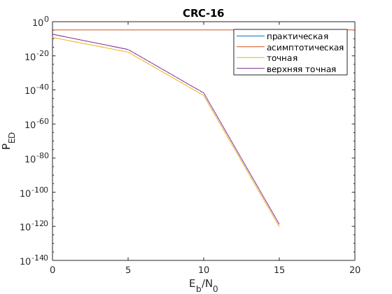

## Эта папка содержит файлы первого допуска к лабораторной по курсу сети и системы мобильной связи.
>
Содержимое:
>
>> - example.m - главный скрипт.
>> - gen_mes.m - скрипт генерации информационных слов
>> - crc.m - скрипт создания кодовых слов
>> - noise.m - скрипт наложения шума
>> - simulation.m - управляющий скрипт всего моделирования
>> - check.m - скрипт проверки контрольной суммы и подсчета вероятности ошибки на бит
>> - theor_ped.m - скрипт генерации теоретических оценок
>
В данной работе использовались два вида многочленов: CRC-3 и CRC-16.
>
Для CRC-3 графики SNR и PED выглядят следующим образом:
>

>

>
Графики для CRC-16:
>

>

