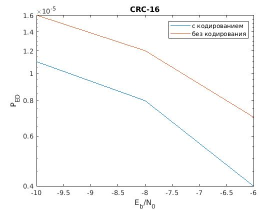
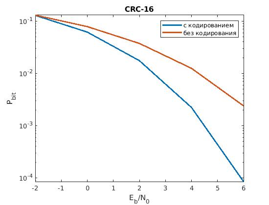
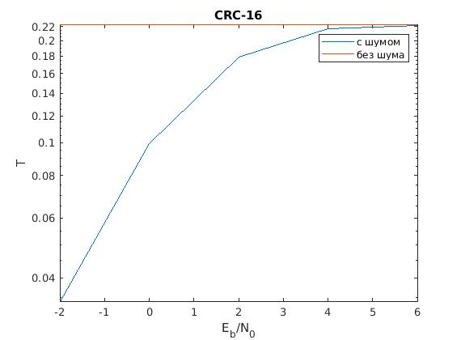
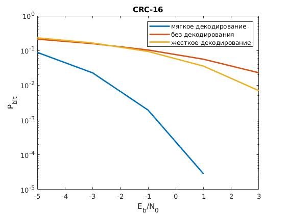

## Эта папка содержит файлы второго допуска к лабораторной по курсу сети и системы мобильной связи.
>
Содержимое:
>
- example.m - главный скрипт
- hamming\_coder.m - создание кода Хемминга с помощью стандартного алгоритма
- hamming\_coder\_adv.m - создание кода Хемминга с помощью порождающей матрицы
- hamming\_decoder.m - декодирование кода Хемминга с помощью стандартного алгоритма
- hamming\_decoder\_adv.m - декодирование кода Хемминга с помощью синдромного декодирования
- divide\_mes.m - разделение сообщения на подблоки
- add\_zeros.m - добавление нулей для стандартгного алгоритма
- add\_zeros\_adv.m - добавление нулей для алгоритма, использующего матрицы
- delete\_zeros.m - удаление нулей для стандартгного алгоритма
- delete\_zeros\_adv.m - удаление нулей для алгоритма, использующего матрицы
- unite\_mes.m - объединение пришедших из канала подблоков в единое сообщение для стандартного алгоритма
- unite\_mes\_adv.m - объединение пришедших из канала подблоков в единое сообщение для алгоритма с матрицами
- gen_mes.m - скрипт генерации информационных слов
- crc.m - скрипт создания кодовых слов
- noise.m - скрипт наложения шума
- simulation.m - управляющий скрипт всего моделирования
- check.m - скрипт проверки контрольной суммы и подсчета вероятности ошибки на бит
- theor_ped.m - скрипт генерации теоретических оценок
>
Результаты выполнения программы:
>

>

>

>

